# Aurora — H&M Fashion Recommender

This project builds a fashion recommender five times over, starting from the dumbest
thing that works and ending with a two-stage system of the kind that wins Kaggle
competitions. Every version is scored the same way on the same held-out week, so the
final table is an honest comparison rather than five numbers that happen to sit near
each other.

The point is not the score. The point is being able to see what each step adds, and
where each one stops working.

## The problem

H&M sells clothes online, and the question is which twelve articles to put in front of
a customer next week. The data is a year and a half of purchase history, a catalog of
around 105,000 articles, and one product photo for each of them. There are no ratings,
no clicks and no returns — only the fact that someone bought something on some day.
That makes this an implicit feedback problem: I know what people bought, but never what
they looked at and passed on, and I can't tell a lukewarm purchase from an enthusiastic
one.

Two things make it harder than it first looks. Most customers buy very little, so there
is almost nothing to personalise on. And the catalog moves constantly: about an eighth of
the articles bought during the test week had never been sold before it, so a model that
only knows what has already sold is blind to them.

## The data

The Kaggle release has three tables and a folder of images. `transactions_train.csv` is
3.3 GB and holds 31.8 million purchases between September 2018 and September 2020.
`customers.csv` has 1.37 million customers with a little profile information such as age
and club membership. `articles.csv` describes 105,542 articles with around twenty
categorical fields plus a one-line description. The `images/` folder holds one photo per
article, 105,100 of them, sorted into subfolders by the first three digits of the
article id.

Here is a random sample of the catalog, which is worth looking at before any modelling
because it explains why the photos turn out to be useful later:

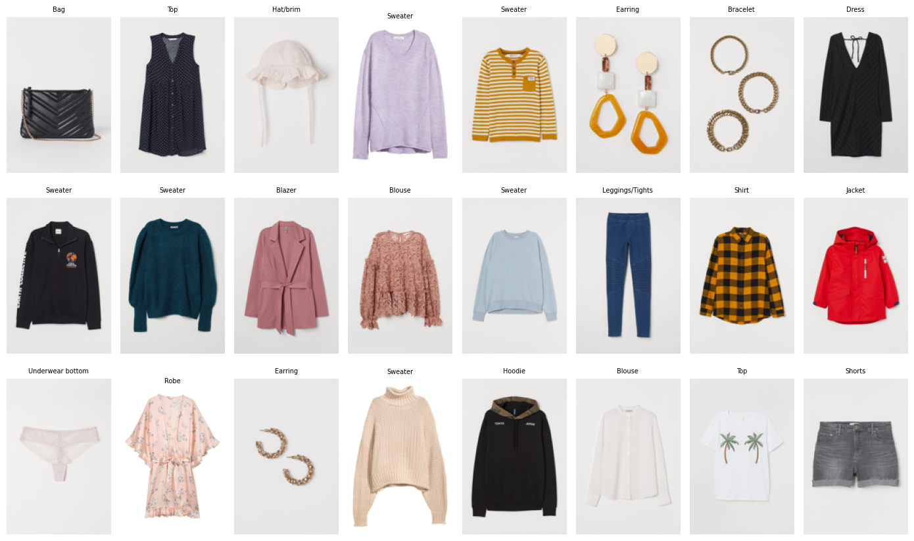

## How I sampled it

Training on 31.8 million rows would have meant waiting several minutes for every
experiment, and I ran a few hundred experiments. So the first thing `data/sample_data.py`
does is cut the transaction table down to the **last 140 days**, and nothing downstream
ever sees a row outside that window.

The window comes first for a reason that matters more than speed. Fashion is seasonal
and the catalog turns over weekly, so a customer's purchases from 2018 say very little
about what they will buy in September 2020. When I first built this I kept each sampled
customer's full history, and the training set ended up containing 73,468 distinct
articles — two thirds of which were discontinued stock the models were happily ranking.
Cutting to the window brought that down to 26,672 articles that are actually on sale.

From inside that window I take a random **6% of the customers** and keep all of their
in-window purchases. Sampling customers rather than transactions is deliberate: picking
random transactions would tear holes in people's purchase sequences, and three of the
five models read those sequences. The customer list is sorted before sampling, because
otherwise the seeded sample comes back different on every run and the cached image
embeddings quietly stop matching the data they were built from.

The result is 382,423 transactions from 39,540 customers across 28,086 articles — small
enough that a full experiment runs in a couple of minutes.

The split follows the competition setup. The last week of the window is the test set,
the week before it is validation, and everything earlier is training. Splitting by time
rather than at random is the only honest option here, because recommending next week's
purchases from next week's data is not a problem anyone has.

One more rule about how that split is used, and it turned out to matter more than any
model choice: **every hyperparameter is picked on the validation week, and then every
model is refitted on train and validation together before it predicts the test week.**
That is what a weekly production retrain does. Fitted on training data alone, a model's
view of the world stops a week before the week it is predicting, and that week is
expensive: only 2.0% of test purchases are repeats of something the customer bought in
training, against 3.9% of something they bought in training or validation, and test
recall of the last-7-day bestseller list falls from 0.223 to 0.178. Adding that one week
back roughly doubled four of the five models. All five use the same rule, so the
comparison stays fair.

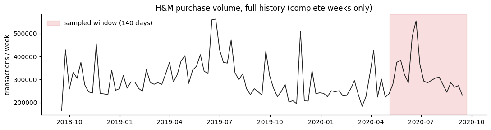

| split | dates | transactions | customers | articles |
|---|---|---|---|---|
| train | 2020-05-06 → 2020-09-08 | 352,678 | 37,764 | 26,672 |
| validation | 2020-09-09 → 2020-09-15 | 15,184 | 4,383 | 5,537 |
| test | 2020-09-16 → 2020-09-22 | 14,561 | 4,155 | 5,244 |

## Image embeddings

Before any model runs, `data/extract_image_embeddings.py` pushes every sampled article's
photo through a frozen pretrained encoder once and saves the result. The encoder is never
trained or fine-tuned — it is used purely to turn a photo into 512 numbers, and the models
read those numbers instead of ever opening a JPEG. The whole thing takes about 90 seconds
on the GPU and never needs to run again.

I cached two encoders so I could compare them. ResNet-18 was trained on ImageNet labels,
and CLIP was trained on image–text pairs. They behave noticeably differently. ResNet
groups things by shape and colour and will cheerfully cross garment types, while CLIP
stays inside the category a person would have named:

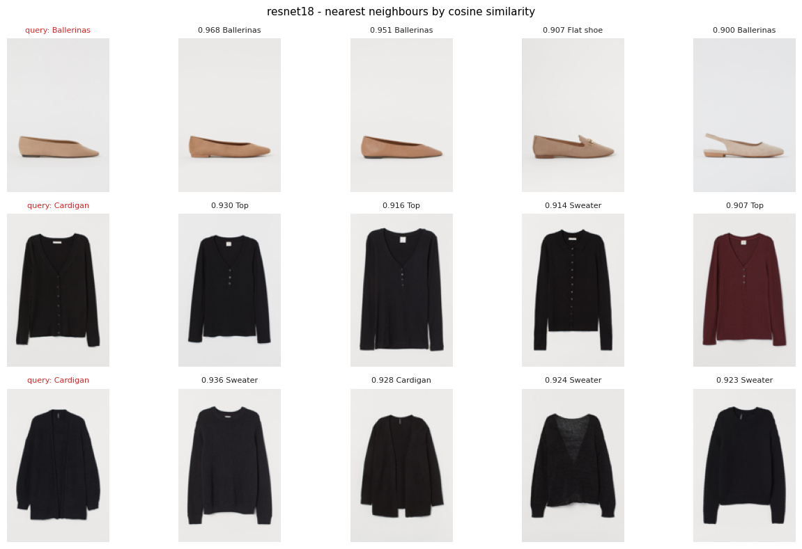

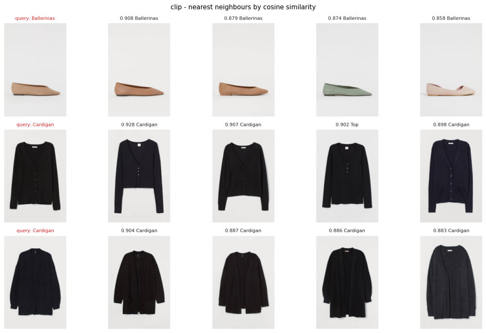

Look at the first row of each. Both find beige flat shoes, but ResNet's third result is
tagged "Flat shoe" rather than "Ballerinas" — it went by the picture, not the label. In
the second row ResNet pulls black tops and sweaters for a black cardigan, while CLIP
returns cardigans. Measured across all 28,043 articles, CLIP's ten nearest neighbours
share the catalog's own product type 75% of the time against ResNet's 63%, and the two
encoders only agree on 27% of their neighbours, so they really are different signals.

I used CLIP in the end, because for recommending a substitute item you want "the same
kind of thing", not "something that looks similar from across the room". Both files stay
on disk, and switching between them is one constant.

## How everything is measured

`src/metrics.py` is written once and imported unchanged by all five models. Every model
returns the same thing — a dictionary of customer id to a ranked list of article ids —
so nothing about the scoring changes from model to model.

For k of 12, 50 and 100 it computes precision, recall, hit rate, NDCG and MAP. Two
details are worth stating because they affect the numbers. MAP and NDCG divide by
`min(number bought, k)` rather than by k, which is the convention Kaggle used for this
competition and means a customer who bought three things can still score 1.0.
Predictions are also deduplicated before scoring, because a model that repeats an
article would otherwise get credit for the same hit twice.

Each model appends one row to `results/metrics_comparison.csv`, which is where the final
table comes from.

## The five models

### 1. Popularity

Count how many times each article was bought during training, sort by that count, and
give every customer the same top 100. There is no personalisation at all.

This exists to set the floor. Any model that cannot beat "everyone gets the bestsellers"
has not earned the complexity it costs, and that floor is higher than it sounds because
a handful of basics take a large share of all purchases.

You can see the problem with it immediately. This customer bought grey and cream
knitwear, and the model offered them leggings, socks, underwear and a red bikini:

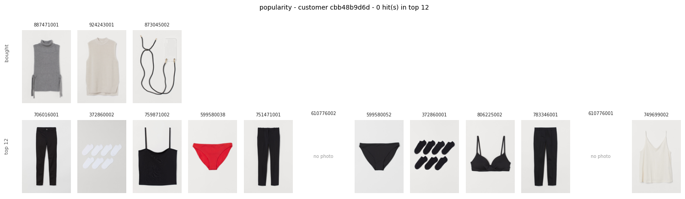

The top row is what the customer actually bought during the test week; the bottom row is
what the model recommended, with hits outlined in green. That layout repeats for every
model below, always for the same customer, so you can read the progression straight down
the page: this customer gets nothing from popularity, two hits once ALS arrives, and
three from the two-stage system, which works out that they buy jeans.

A word on that customer. The notebook shows three of them, and they were picked on
purpose — of the roughly 1,700 test customers who bought between three and twelve
articles, 93 have a hit count that never drops as the models improve, and these are
among them. They are not typical: most customers get zero hits from every model, which
is what a hit rate of 12% at k=12 means. The comparison table further down is the
unbiased view, and these pictures are here to show what the models are *doing*, not how
often they succeed.

### 2. Collaborative filtering (ALS)

The first personalised model. It ignores everything about what an article *is* — no
photos, no descriptions, no categories — and looks only at who bought what. Purchases go
into a big sparse customer-by-article matrix, and ALS factorises it into a short vector
per customer and per article whose dot product reproduces the purchases it was shown.
Recommendations are the articles whose vectors point the same way as the customer's.

What this adds over popularity is co-purchase: the model works out that people who buy
this tend to also buy that, without anyone describing either item. For the same customer
the difference is obvious — neutral knitwear, blouses and trousers instead of a generic
bestseller list:

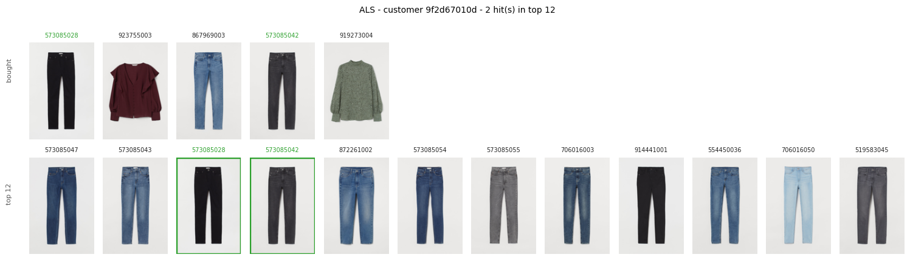

Three settings mattered, and I picked all three on the validation week rather than by
taste:

- **Time decay.** A purchase counts as `40 / (1 + days before the split)`, so last
  week's basket outweighs one from four months ago. This was the single biggest
  improvement in the whole project, taking validation MAP@12 from 0.0141 to 0.0241. I
  took the idea from [JonMcEntee/hm-fashion-recommendations](https://github.com/JonMcEntee/hm-fashion-recommendations)
  and re-tuned the constant, which turns out to plateau anywhere between 40 and 80.
- **BM25 weighting**, which pushes down the bestsellers everyone buys so the factors
  spend their capacity on more informative co-purchases.
- **Not filtering out articles the customer already bought.** Suppressing them costs
  about half the score, because people rebuy clothes constantly.

The thing ALS fundamentally cannot do is rank an article nobody has bought yet. A new
article has no column in the matrix, so it has no vector, so it can never be
recommended. That is what the next model is for.

### 3. Content-based

This model describes items instead of counting them. Each article becomes a vector built
from its categorical fields, a TF-IDF of its one-line description, and its cached image
embedding. The sparse text and category blocks get reduced with SVD, and similarity is a
blend of two cosine similarities, one on metadata and one on the photo. A customer is
represented by the recency-weighted average of what they bought, and the recommendations
are the catalog articles nearest to that average.

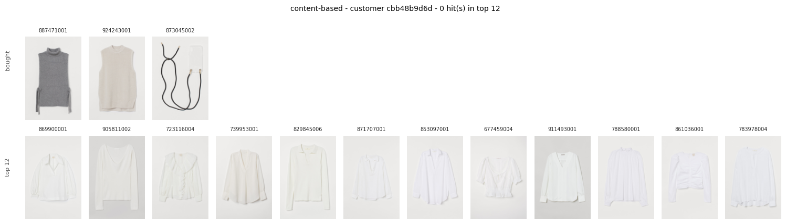

It scores below ALS overall, which is not surprising — for a customer with history,
knowing who buys what beats knowing what things look like. What it adds is reach.
Because a vector comes from the article's own attributes, an article that nobody has
ever bought still has one.

The clearest way to see this is to score both models against **only** the cold-start
purchases, meaning test-week buys of the 639 articles that had never sold before that
week. 893 customers bought at least one:

| model | recall@12 | recall@100 | hit rate@100 |
|---|---|---|---|
| ALS | 0.0 | 0.0 | 0.0 |
| content-based | 0.0065 | 0.0291 | 0.0370 |

ALS scores exactly zero, and not because of rounding. Those articles are not in its
matrix, so the score is structurally zero. That is the whole argument for this model.

The photo earns its place too. On the validation week, metadata alone scored 0.01548,
and blending the CLIP embedding in at equal weight scored 0.01852 — about 20% better.
Using only the photo and discarding the text and categories was worse than either, so
the image is a useful supplement rather than a replacement.

### 4. Two-tower neural retrieval

Models 2 and 3 each use half the evidence. ALS sees co-purchases and nothing about the
items; the content model sees the items and nothing about who buys together. A two-tower
network learns both at once. One tower turns a customer into a vector, the other turns
an article into a vector, and training pushes each customer towards the articles they
actually bought.

The item tower reads the same content features as model 3, plus a free per-article
vector learned from the interactions themselves. That learned part is what carries the
collaborative signal, and it stays at its zero starting value for articles nobody
bought, so cold-start items fall back to pure content and still work. The user tower
reads the recency-weighted average of what the customer bought together with their age,
club status and news preferences.

Training uses in-batch negatives: inside a batch of (customer, bought article) pairs,
every other customer's article counts as a negative, so a single matrix multiply gives
thousands of negatives for free.

One detail decides whether this trains at all. The user vector is an average of the
articles the customer bought, so if the target article is left inside that average, the
model can score it by recognising itself and learns nothing useful. Every training pair
subtracts its own article from the customer's average before the forward pass.

**This model came last among the personalised models on MAP@12, and I left it that
way.** Temperature turned out to be the dominant setting — raising it from 0.05 to 0.15
moved validation MAP@12 from 0.0129 to 0.0157 — and the learned item vector only helped
at the lower learning rate; at 1e-3 the model memorised instead, with training loss
falling while validation got worse. Even properly tuned it does not catch ALS. With
309,000 interactions across 28,000 articles this is a small dataset for a neural
retriever, and matrix factorisation is very hard to beat at that size. That is a real
finding rather than a bug to tune away.

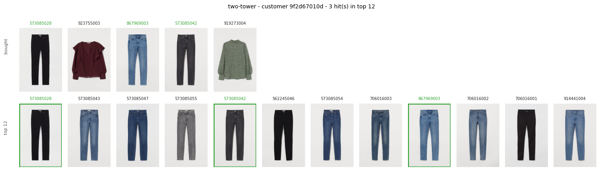

It still earns its place in the candidate pool. Its recall@100 (0.081) beats the
content model's (0.073) even though its MAP@12 is lower than both, so it finds articles
the others miss and simply orders them worse — which is exactly the division of labour
the last model assumes.

### 5. Two-stage: multi-recall plus a LightGBM ranker

Each of the four models is wrong in its own way. Popularity ignores the person, ALS
ignores the item, content ignores co-purchase, and the two-tower orders things poorly.
The solutions that won this competition did not pick one of these — they pooled
candidates from several cheap retrievers and trained a ranker to sort the pool.

**Stage one** lives in `src/retrievers.py`: a `Retriever` base class with six
implementations. Three of them wrap models 2 to 4. The other three are heuristics that
cost almost nothing, and they matter more than the models do:

- `RecentBestsellers` — what sold most in the last seven days. On its own, the top 300
  of this list reaches a recall of 0.178 on the test week, which is more than the entire
  four-model pool managed before it was added.
- `PreviousPurchases` — the customer's own articles, most recent first. About eight
  candidates per customer, and the highest precision per candidate of anything here.
- `ColourVariants` — other colourways of garments they already bought. H&M gives every
  colourway of a garment the same `product_code`, so this is a single join.

**Stage two** describes every (customer, candidate) pair with thirteen features and
trains LightGBM's `lambdarank` on them: each retriever's rank for that pair, how many of
the six nominated it, the best rank any of them gave it, the article's purchase count,
popularity rank and days since it last sold, how often this customer already bought it,
and how active they are.

Two details decide whether this works at all, and I found both the hard way.

**Labels come from four weeks, not one.** Each training week uses a rolling origin:
retrievers are refitted on data strictly before that week, asked for candidates, then
labelled with what was actually bought during it. Refitting per week is the slow part of
the script and it is not optional. My first attempt reused one fitted model across all
the label weeks, which let the two-tower nominate candidates it had been trained on, and
the weeks inside training showed three times the positives of the validation week. The
ranker learned that those candidates were excellent, which is false at prediction time,
and the score got worse.

**Negatives are downsampled.** A full pool is 0.17% positives, and the ranker was
drowning in it — more trees made it score worse, and switching to a binary objective did
not help either. Keeping every positive plus thirty negatives per customer, and dropping
customers with no positive at all, cuts the training rows thirtyfold and scores better.
The ratio was chosen on the validation week, where anything from ten to three hundred
lands within 1.5% of the same score.

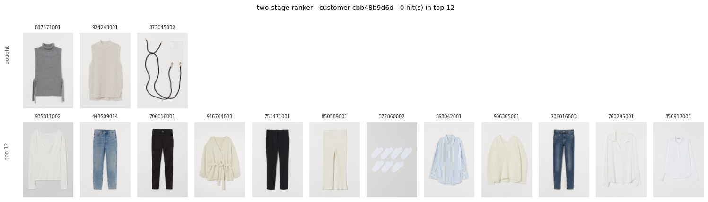

Two results from this are more interesting than the score.

**The bottleneck moved.** An earlier version pooled only the four trained models and
reached a recall ceiling of 0.085 — and the ranker extracted 97% of it. Ranking was
saturated and recall was the constraint, so adding the heuristic retrievers was the
obvious fix. The ceiling is now about 0.32, and the ranker reaches roughly half of it.
Recall is no longer what limits this system; ordering is. That points at richer ranker
features rather than more candidates.

**The most useful features are not the model ranks.** Article purchase count, customer
activity and how recently an article sold all outrank every retriever's opinion. The
retriever ranks matter more as a committee — how many agreed, and how strongly — than as
individual orderings.

## Results

All five models, same test week, same metrics module, 4,155 customers who bought
something during that week.

| model | P@12 | R@12 | Hit@12 | NDCG@12 | MAP@12 | P@50 | R@50 | Hit@50 | NDCG@50 | MAP@50 | P@100 | R@100 | Hit@100 | NDCG@100 | MAP@100 |
|---|---|---|---|---|---|---|---|---|---|---|---|---|---|---|---|
| 01 popularity | 0.00283 | 0.01146 | 0.03201 | 0.00715 | 0.00350 | 0.00142 | 0.02345 | 0.06426 | 0.01045 | 0.00396 | 0.00126 | 0.04052 | 0.10686 | 0.01427 | 0.00424 |
| 02 collaborative ALS | 0.00959 | 0.05196 | 0.09338 | 0.03547 | 0.02434 | 0.00375 | 0.07603 | 0.14320 | 0.04222 | 0.02555 | 0.00238 | 0.09462 | 0.17786 | 0.04611 | 0.02587 |
| 03 content-based | 0.00590 | 0.03319 | 0.06065 | 0.02492 | 0.01833 | 0.00256 | 0.05383 | 0.10181 | 0.03053 | 0.01934 | 0.00185 | 0.07272 | 0.14176 | 0.03465 | 0.01967 |
| 04 two-tower | 0.00644 | 0.03484 | 0.06546 | 0.02366 | 0.01579 | 0.00288 | 0.05933 | 0.10975 | 0.03027 | 0.01698 | 0.00205 | 0.07986 | 0.14874 | 0.03471 | 0.01736 |
| **05 two-stage ranker** | **0.01177** | **0.06243** | **0.11721** | **0.04137** | **0.02732** | **0.00589** | **0.11645** | **0.22695** | **0.05625** | **0.02993** | **0.00424** | **0.16062** | **0.31119** | **0.06574** | **0.03072** |

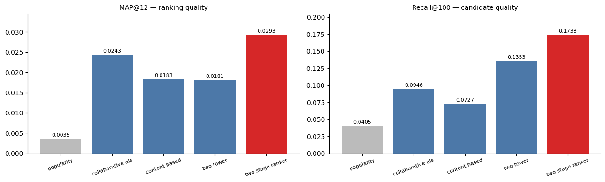

The two-stage system ends up at about 8 times the popularity floor on MAP@12 and
nearly four times its hit rate, and it wins on every single column. It also beats its own
best retriever, ALS, by 12% — which is the thing a two-stage system has to do to justify
existing.

## What these numbers actually mean

They are small, and they are supposed to be. The team that won this competition scored
0.0372 MAP@12 on the full dataset with a ranker built on hundreds of features over a
multi-strategy recall ensemble. Anyone quoting a much higher number on this task is
usually measuring something easier.

It helps to think about what MAP@12 of 0.027 represents. A typical customer bought two
or three things during the test week, out of a catalog of 28,000 articles, and about a
fifth of what they bought had never been sold before. Getting one of those twelve slots
right about 12% of the time is not a broken model — it is a genuinely hard prediction.

One caveat on reproducibility. The sampling, ALS and content-based stages are fully
deterministic and give identical numbers every run. Two-tower training is not, because
of GPU non-determinism, and it moves MAP@12 by roughly ±0.001 between runs, which
carries into the two-stage model through the candidate pool.

## What I would do with more compute

These are things I deliberately did not do, not things I ran out of time for.

**Give the ranker more features.** This is now the highest-value change, and the ceiling
measurement says so: the pool makes a recall of 0.32 reachable and the ranker gets about
half of it, so the gain has to come from better ordering rather than more candidates.
Thirteen features is a deliberate limit; the winning solutions used hundreds. Price
relative to what this customer usually spends, how a product is selling week over week,
sales channel preference, age-group affinity per article — each is small on its own and
they add up.

**Fine-tune the image encoder instead of freezing it.** CLIP was trained on general
internet images, not on clothing photographed flat on a grey background. Fine-tuning it
on this catalog, or training it against purchase co-occurrence, would probably produce
much sharper embeddings than the off-the-shelf ones. I kept it frozen because it costs
90 seconds that way and hours the other way.

**Make the ranker sequence-aware.** Right now a customer is a bag of purchases with a
recency weight. What they bought in order carries more information than that — a coat
bought last week changes what makes sense this week in a way a weighted average cannot
express. A small transformer over the purchase sequence is the standard answer.

**Push the candidate pool further.** Widening recall was worth a lot once, taking the
ceiling from 0.085 to 0.32, and there is more left: larger k per retriever, an item-item
cosine kNN retriever, and candidates drawn from what similar customers bought.

**Correct the two-tower's negative sampling.** In-batch negatives are biased towards
popular items, since popular articles appear as negatives more often. The standard logQ
correction adjusts for this and would likely close part of the gap to ALS.

## Running it

Install the dependencies, and note that torch and torchvision need the CUDA index:

```bash
pip install torch==2.11.0 torchvision==0.26.0 --index-url https://download.pytorch.org/whl/cu130
pip install -r requirements.txt
```

Put the Kaggle dataset in `data/raw/` so that it contains `transactions_train.csv`,
`customers.csv`, `articles.csv` and the `images/` folder. Then run the pipeline in
order:

```bash
python data/sample_data.py                  # about 4 seconds
python data/extract_image_embeddings.py     # about 3 minutes, both encoders

cd models
python 01_popularity.py
python 02_collaborative_als.py
python 03_content_based.py
python 04_two_tower.py
python 05_two_stage_ranker.py            # about 6 minutes, refits per label week
```

Each model prints its own scores and appends a row to `results/metrics_comparison.csv`.
`notebooks/end_to_end.ipynb` runs the whole story end to end with the figures shown
above, and it is the best place to start reading.

Everything here runs on a single RTX 4060 with 8 GB of VRAM. The longest single step is
the image embedding extraction at about 90 seconds per encoder.

## The web app

There is a small React front end that serves the two-stage model's recommendations, so
you can click through customers instead of reading a metrics table.

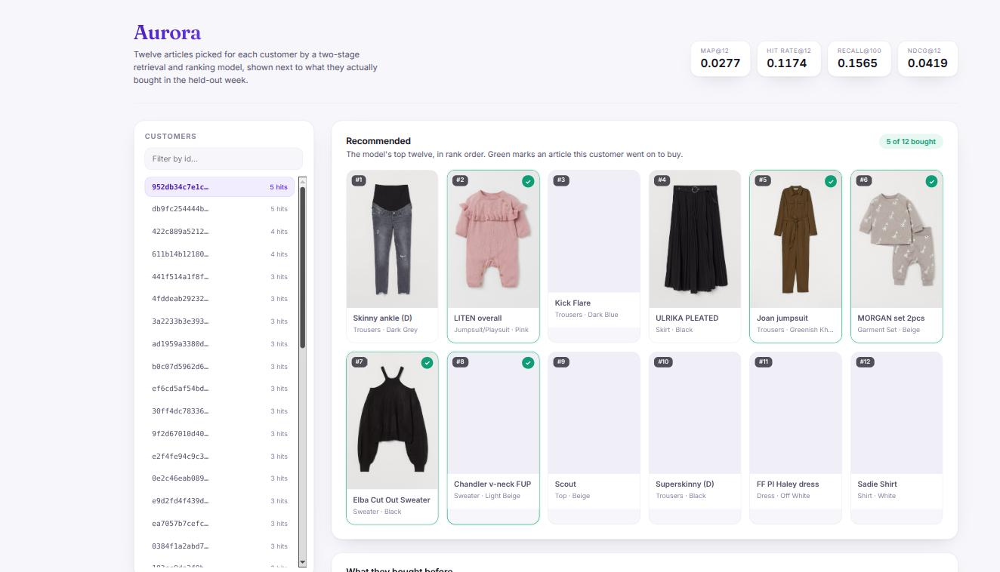

Fitting the two-stage model takes several minutes, so the API does not do it per
request. `api/precompute.py` runs the model once and caches its output — the top twelve
per customer, what that customer actually bought in the held-out week, their recent
purchase history, and the article metadata. These are the same predictions that produced
the score in the table above; nothing is re-ranked at serve time.

```bash
python api/precompute.py                        # about 6 minutes, writes api/artifacts/
python -m uvicorn api.main:app --port 8000      # FastAPI on :8000

cd web && npm install && npm run dev            # Vite on :5173, proxies /api
```

The API is four endpoints: `/api/metrics`, `/api/customers`, `/api/customers/{id}` and
`/api/images/{article_id}`, each a thin call into a `RecommendationStore` that loads the
cached parquet once and answers from memory.

One thing about the customer list is worth explaining, because it would otherwise
flatter the model. It is sorted by how many hits the model got, best first. Sorted
randomly you would click through a dozen customers and see nothing highlighted at all,
because the real hit rate is about 12% — the app says so in a footnote rather than
letting the ordering imply otherwise.

## Layout

```
data/
  sample_data.py                     window filter, customer sample, time split
  extract_image_embeddings.py        frozen encoders, one embedding per article
  image_embeddings_clip.parquet      cached CLIP vectors
  image_embeddings_resnet18.parquet  cached ResNet-18 vectors
api/
  precompute.py                      runs the model once, caches what the API serves
  store.py                           RecommendationStore, reads the cached parquet
  main.py                            FastAPI routes
web/
  src/App.jsx                        the page
  src/api.js                         AuroraApi client
  src/components/                    ProductCard, CustomerList, Section
src/
  data_utils.py                      shared loading, and the refit-on-train+val rule
  metrics.py                         precision, recall, hit rate, NDCG, MAP
  retrievers.py                      Retriever base class and the six candidate sources
models/
  01_popularity.py
  02_collaborative_als.py
  03_content_based.py
  04_two_tower.py
  05_two_stage_ranker.py
results/
  metrics_comparison.csv             one row per model
notebooks/
  end_to_end.ipynb                   EDA through to the final comparison
```

Every script has a docstring at the top explaining what it does and why the settings are
what they are. There are no inline comments anywhere, on purpose — if a line needs
explaining, it belongs in the docstring.
