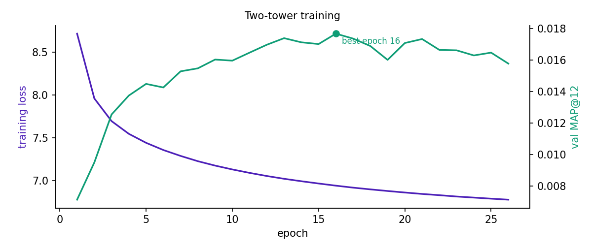
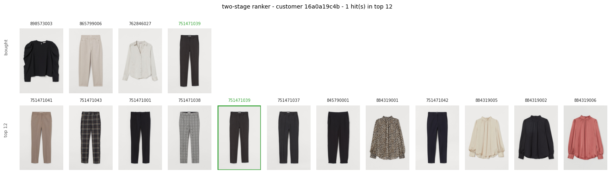
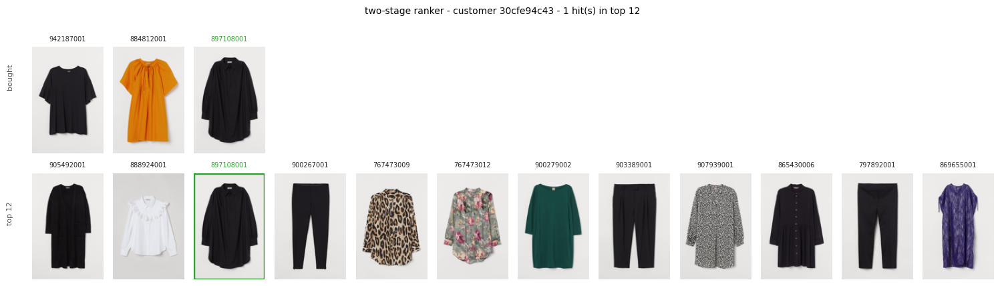
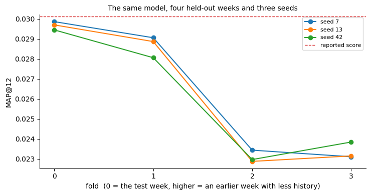

# Aurora — H&M Fashion Recommender

> Five recommenders built on the same data and scored the same way, from a popularity
> baseline to a two-stage retrieval-and-ranking system.

**Python** · **PyTorch** · **LightGBM** · **Polars** · **implicit** · **OpenCLIP** · **FastAPI** · **React**

This project builds a fashion recommender five times over, starting from the dumbest
thing that works and ending with a two-stage system of the kind that wins Kaggle
competitions. Every version is scored the same way on the same held-out week, so the
final table is an honest comparison rather than five numbers that happen to sit near
each other.

The point is not the score. The point is being able to see what each step adds, and
where each one stops working.

**Contents**

1. [The problem](#the-problem)
2. [The data](#the-data)
3. [How I sampled it](#how-i-sampled-it)
4. [Image embeddings](#image-embeddings)
5. [How everything is measured](#how-everything-is-measured)
6. [The five models](#the-five-models)
7. [Results](#results)
8. [What these numbers actually mean](#what-these-numbers-actually-mean)
9. [How much should you trust these numbers?](#how-much-should-you-trust-these-numbers)
10. [What I would do with more compute](#what-i-would-do-with-more-compute)
11. [Running it](#running-it)
12. [The web app](#the-web-app)
13. [Layout](#layout)

---

## The problem

H&M sells clothes online, and the question is which twelve articles to put in front of
a customer next week. The data is a year and a half of purchase history, a catalog of
around 105,000 articles, and one product photo for each of them. There are no ratings,
no clicks and no returns — only the fact that someone bought something on some day.
That makes this an implicit feedback problem: I know what people bought, but never what
they looked at and passed on, and I can't tell a lukewarm purchase from an enthusiastic
one.

Two things make it harder than it first looks. Most customers buy very little, so there
is almost nothing to personalise on. And the catalog moves constantly: about an eighth of
the articles bought during the test week had never been sold before it, so a model that
only knows what has already sold is blind to them.

---

## The data

The Kaggle release has three tables and a folder of images. `transactions_train.csv` is
3.3 GB and holds 31.8 million purchases between September 2018 and September 2020.
`customers.csv` has 1.37 million customers with a little profile information such as age
and club membership. `articles.csv` describes 105,542 articles with around twenty
categorical fields plus a one-line description. The `images/` folder holds one photo per
article, 105,100 of them, sorted into subfolders by the first three digits of the
article id.

Here is a random sample of the catalog, which is worth looking at before any modelling
because it explains why the photos turn out to be useful later:


---

## How I sampled it

Training on 31.8 million rows would have meant waiting several minutes for every
experiment, and I ran a few hundred experiments. So the first thing `src/data/sampling.py`
does is cut the transaction table down to the **last 140 days**, and nothing downstream
ever sees a row outside that window.

The window comes first for a reason that matters more than speed. Fashion is seasonal
and the catalog turns over weekly, so a customer's purchases from 2018 say very little
about what they will buy in September 2020. When I first built this I kept each sampled
customer's full history, and the training set ended up containing 73,468 distinct
articles — two thirds of which were discontinued stock the models were happily ranking.
Cutting to the window brought that down to 26,672 articles that are actually on sale.

From inside that window I take a random **6% of the customers** and keep all of their
in-window purchases. Sampling customers rather than transactions is deliberate: picking
random transactions would tear holes in people's purchase sequences, and three of the
five models read those sequences. The customer list is sorted before sampling, because
otherwise the seeded sample comes back different on every run and the cached image
embeddings quietly stop matching the data they were built from.

The result is 382,423 transactions from 39,540 customers across 28,086 articles — small
enough that a full experiment runs in a couple of minutes.

The split follows the competition setup. The last week of the window is the test set,
the week before it is validation, and everything earlier is training. Splitting by time
rather than at random is the only honest option here, because recommending next week's
purchases from next week's data is not a problem anyone has.

One more rule about how that split is used, and it turned out to matter more than any
model choice: **every hyperparameter is picked on the validation week, and then every
model is refitted on train and validation together before it predicts the test week.**
That is what a weekly production retrain does. Fitted on training data alone, a model's
view of the world stops a week before the week it is predicting, and that week is
expensive: only 2.0% of test purchases are repeats of something the customer bought in
training, against 3.9% of something they bought in training or validation, and test
recall of the last-7-day bestseller list falls from 0.223 to 0.178. Adding that one week
back roughly doubled four of the five models. All five use the same rule, so the
comparison stays fair.


| split | dates | transactions | customers | articles |
|---|---|---|---|---|
| train | 2020-05-06 → 2020-09-08 | 352,678 | 37,764 | 26,672 |
| validation | 2020-09-09 → 2020-09-15 | 15,184 | 4,383 | 5,537 |
| test | 2020-09-16 → 2020-09-22 | 14,561 | 4,155 | 5,244 |

---

## Image embeddings

Before any model runs, `src/data/image_embeddings.py` pushes every sampled article's
photo through a frozen pretrained encoder once and saves the result. The encoder is never
trained or fine-tuned — it is used purely to turn a photo into 512 numbers, and the models
read those numbers instead of ever opening a JPEG. The whole thing takes about 90 seconds
on the GPU and never needs to run again.

I cached two encoders so I could compare them. ResNet-18 was trained on ImageNet labels,
and CLIP was trained on image–text pairs. They behave noticeably differently. ResNet
groups things by shape and colour and will cheerfully cross garment types, while CLIP
stays inside the category a person would have named:


Look at the first row of each. Both find beige flat shoes, but ResNet's third result is
tagged "Flat shoe" rather than "Ballerinas" — it went by the picture, not the label. In
the second row ResNet pulls black tops and sweaters for a black cardigan, while CLIP
returns cardigans. Measured across all 28,043 articles, CLIP's ten nearest neighbours
share the catalog's own product type 75% of the time against ResNet's 63%, and the two
encoders only agree on 27% of their neighbours, so they really are different signals.

I used CLIP in the end, because for recommending a substitute item you want "the same
kind of thing", not "something that looks similar from across the room". Both files stay
on disk, and switching between them is one constant.

---

## How everything is measured

`src/evaluation/metrics.py` is written once and imported unchanged by all five models.
Every model returns the same thing — a dictionary of customer id to a ranked list of
article ids — so nothing about the scoring changes from model to model.

For k of 12, 50 and 100 it computes precision, recall, hit rate, NDCG and MAP. Two
details are worth stating because they affect the numbers. MAP and NDCG divide by
`min(number bought, k)` rather than by k, which is the convention Kaggle used for this
competition and means a customer who bought three things can still score 1.0.
Predictions are also deduplicated before scoring, because a model that repeats an
article would otherwise get credit for the same hit twice.

Each model appends one row to `results/metrics_comparison.csv`, which is where the final
table comes from.

Accuracy on its own would not notice a recommender that has quietly learned to show
everybody the same few hundred bestsellers, because on a catalog this skewed that
strategy scores respectably. So the same module also reports what the lists look like as
a whole — what share of the catalog they touch, how obvious the articles in them are, and
how many distinct product types sit in a single list — and it can score any group of
customers separately, which is how the cold and heavy buyers below are pulled apart.

---

## The five models

### 1. Popularity

Count how many times each article was bought during training, sort by that count, and
give every customer the same top 100. There is no personalisation at all.

This exists to set the floor. Any model that cannot beat "everyone gets the bestsellers"
has not earned the complexity it costs, and that floor is higher than it sounds because
a handful of basics take a large share of all purchases.

You can see the problem with it immediately. This customer bought grey and cream
knitwear, and the model offered them leggings, socks, underwear and a red bikini:


The top row is what the customer actually bought during the test week; the bottom row is
what the model recommended, with hits outlined in green. That layout repeats for every
model below, always for the same customer, so you can read the progression straight down
the page: this customer gets nothing from popularity, two hits once ALS arrives, and
three from the two-stage system, which works out that they buy jeans.

A word on that customer. The notebook shows three of them, and they were picked on
purpose from the roughly 1,700 test customers who bought between three and twelve
articles, as customers that popularity gets nothing right for and the later models
do. They are not typical: most customers get zero hits from every model, which
is what a hit rate of 13% at k=12 means. The comparison table further down is the
unbiased view, and these pictures are here to show what the models are *doing*, not how
often they succeed.

### 2. Collaborative filtering (ALS)

The first personalised model. It ignores everything about what an article *is* — no
photos, no descriptions, no categories — and looks only at who bought what. Purchases go
into a big sparse customer-by-article matrix, and ALS factorises it into a short vector
per customer and per article whose dot product reproduces the purchases it was shown.
Recommendations are the articles whose vectors point the same way as the customer's.

What this adds over popularity is co-purchase: the model works out that people who buy
this tend to also buy that, without anyone describing either item. For the same customer
the difference is obvious — neutral knitwear, blouses and trousers instead of a generic
bestseller list:


Three settings mattered, and I picked all three on the validation week rather than by
taste:

- **Time decay.** A purchase counts as `40 / (1 + days before the split)`, so last
  week's basket outweighs one from four months ago. This was the single biggest
  improvement in the whole project, taking validation MAP@12 from 0.0141 to 0.0241. I
  took the idea from [JonMcEntee/hm-fashion-recommendations](https://github.com/JonMcEntee/hm-fashion-recommendations)
  and re-tuned the constant, which turns out to plateau anywhere between 40 and 80.
- **BM25 weighting**, which pushes down the bestsellers everyone buys so the factors
  spend their capacity on more informative co-purchases.
- **Not filtering out articles the customer already bought.** Suppressing them costs
  about half the score, because people rebuy clothes constantly.

The thing ALS fundamentally cannot do is rank an article nobody has bought yet. A new
article has no column in the matrix, so it has no vector, so it can never be
recommended. That is what the next model is for.

### 3. Content-based

This model describes items instead of counting them. Each article becomes a vector built
from its categorical fields, a TF-IDF of its one-line description, and its cached image
embedding. The sparse text and category blocks get reduced with SVD, and similarity is a
blend of two cosine similarities, one on metadata and one on the photo. A customer is
represented by the recency-weighted average of what they bought, and the recommendations
are the catalog articles nearest to that average.


It scores below ALS overall, which is not surprising — for a customer with history,
knowing who buys what beats knowing what things look like. What it adds is reach.
Because a vector comes from the article's own attributes, an article that nobody has
ever bought still has one.

The clearest way to see this is to score both models against **only** the cold-start
purchases, meaning test-week buys of the 639 articles that had never sold before that
week. 893 customers bought at least one:

| model | recall@12 | recall@100 | hit rate@100 |
|---|---|---|---|
| ALS | 0.0 | 0.0 | 0.0 |
| content-based | 0.0065 | 0.0291 | 0.0370 |

ALS scores exactly zero, and not because of rounding. Those articles are not in its
matrix, so the score is structurally zero. That is the whole argument for this model.

The photo earns its place too. On the validation week, metadata alone scored 0.01548,
and blending the CLIP embedding in at equal weight scored 0.01852 — about 20% better.
Using only the photo and discarding the text and categories was worse than either, so
the image is a useful supplement rather than a replacement.

### 4. Two-tower neural retrieval

Models 2 and 3 each use half the evidence. ALS sees co-purchases and nothing about the
items; the content model sees the items and nothing about who buys together. A two-tower
network learns both at once. One tower turns a customer into a vector, the other turns an
article into a vector, and training pushes each customer towards the articles they
actually bought.

The item tower reads the same content features as model 3, plus a free per-article vector
learned from the interactions themselves. That learned part carries the collaborative
signal, and it stays at its zero starting value for articles nobody bought, so cold-start
items fall back to pure content and still work. The user tower reads the recency-weighted
average of what the customer bought together with their age, club status and news
preferences.

Training uses in-batch negatives: inside a batch of (customer, bought article) pairs,
every other customer's article counts as a negative, so a single matrix multiply gives
thousands of negatives for free. Three details decide whether that works.

**The positive has to be removed from the user's own average.** The user vector is an
average of purchased articles, so leaving the target inside it lets the model score that
article by recognising itself, which teaches it nothing. Every training pair subtracts its
own article before the forward pass.

**In-batch negatives are biased towards popular items.** A popular article turns up as a
negative far more often, so the model learns to push it down for being popular rather than
for being wrong. Subtracting the log of each item's frequency from the logits corrects for
that sampling bias and is worth about 8% on the validation week.

**Training has to stop at the right time.** Validation stops improving around epoch 15
while the training loss keeps falling for another ten, so the model trains with early
stopping and a patience of ten, and the best weights are restored.



Capacity was picked by averaging three seeds rather than trusting one run, because a
single run moves by more than the gap between neighbouring sizes. Towers of 1024 and 256
beat 512 and 256 by about three times the run-to-run spread, narrower was clearly worse,
and more dropout hurt at every width I tried.

This model still ranks below ALS on MAP@12, and that is a real result rather than
something to tune away: 309,000 interactions across 28,000 articles is a small dataset for
a neural retriever. But it has the **best recall@100 of any single model here**, which is
what matters for the job it actually does in the final system, where it feeds candidates
to a ranker rather than answering on its own.


### 5. Two-stage: multi-recall plus a LightGBM ranker

Each of the four models is wrong in its own way. Popularity ignores the person, ALS
ignores the item, content ignores co-purchase, and the two-tower orders things poorly.
The solutions that won this competition did not pick one of these — they pooled
candidates from several cheap retrievers and trained a ranker to sort the pool.

**Stage one** lives in `src/ranking/candidates.py`. Every model implements the same
`Recommender` interface (`fit`, then `recommend`), so any of them can be pooled as a
retriever without a wrapper, and the pool uses two. `RecentBestsellers` takes the 700
articles that sold most in the last seven days, and `TwoTowerRecommender` takes model 4's
top 700 for that customer. Together they put about a thousand candidates per customer in
front of the ranker and make roughly 48% of the right answers reachable.

Using two retrievers rather than six is not a simplification for its own sake. The
heuristics that were in the pool saturate: a customer has only about eight previous
purchases to re-offer, and about fifty colour variants of what they bought, so they stop
contributing once the pool grows. Bestsellers and the two-tower keep paying as k rises. The
other four stay because they are cheap to pool back in: ALS, content, and the two
heuristics in `src/models/heuristics.py`.

**Stage two** describes every (customer, candidate) pair with seventeen features and
trains LightGBM's `lambdarank` on them: where the candidate came from (each retriever's
rank, how many nominated it, the best rank any gave it), how it is selling (lifetime
purchases, last week's purchases, and last week against the week before), what it costs
relative to what this customer usually spends, how recently and how often the customer
buys, and three levels of affinity — this exact article, this garment in another colour,
and this product type.

Those affinity features matter more than they sound. The ranker used to see only whether
the customer had bought that *exact* article, which is the narrowest possible match.
Someone who bought a jumper in black is an obvious candidate for the same jumper in green,
and that never registered before.

Going from nine features to seventeen moved test MAP@12 by about 9%, and three of the five
strongest features by gain are new ones. The ranker's own settings, by contrast, turned
out not to matter: on the validation week 2500 trees at a low learning rate looked clearly
best, but on the test week 600, 1200 and 2500 trees land within 0.0004 of each other,
inside this pipeline's run-to-run variance. 600 is kept because it is the cheapest of
three equivalent options, not because it won. Re-tuning the negative sampling ratio went
the same way: a clear gain on validation, nothing measurable on test.

Two details decide whether this works at all, and I found both the hard way.

**Labels come from four weeks, not one.** Each training week uses a rolling origin:
retrievers are refitted on data strictly before that week, asked for candidates, then
labelled with what was actually bought during it. Refitting per week is the slow part of
the script and it is not optional. My first attempt reused one fitted model across all
the label weeks, which let the two-tower nominate candidates it had been trained on, and
the weeks inside training showed three times the positives of the validation week. The
ranker learned that those candidates were excellent, which is false at prediction time,
and the score got worse.

**Negatives are downsampled.** A full pool is 0.13% positives, and the ranker was
drowning in it — more trees made it score worse, and switching to a binary objective did
not help either. Keeping every positive plus sixty negatives per customer, and dropping
customers with no positive at all, cuts the training rows by roughly twenty-five times and
scores better. The ratio was re-tuned on the validation week after the pool doubled in
size, and anything from ten to three hundred lands within 1.5% of the same score, which
in hindsight was the first sign that this knob was not worth tuning at all.

#### What each stage is worth

The pool already arrives in an order, since every candidate carries the best position any
retriever gave it. Reading the pool out in that order scores the retrieval stage on its
own, before the ranker has said anything, so the gap between the two rows is what stage
two is actually buying.

<!-- generated:stages -->
| stage | MAP@12 | R@12 | NDCG@12 | Hit@12 | R@100 |
|---|---|---|---|---|---|
| 1. retrieval, pool order | 0.01614 | 0.04443 | 0.02726 | 0.09122 | 0.15413 |
| 2. reranked, final | 0.03011 | 0.06591 | 0.04513 | 0.12756 | 0.17671 |

The pool puts 1,054 candidates per customer in front of the ranker and makes 47.5% of what they actually bought reachable. Reordering those candidates is worth 87% on MAP@12 over the order they arrived in, and the ranker converts 37% of the reachable purchases into recall@100.
<!-- /generated -->

#### Who the model actually helps

An average over every customer hides which job the model is doing. Recommending to
somebody with forty purchases behind them is a different problem from recommending to
somebody the pipeline has never seen buy anything, and for that second group only the
bestseller retriever can reach them at all.

<!-- generated:segments -->
| customers | n | MAP@12 | R@100 |
|---|---|---|---|
| cold (no history) | 848 | 0.01140 | 0.11188 |
| light (1-4) | 725 | 0.03817 | 0.17742 |
| heavy (5+) | 2,582 | 0.03399 | 0.19780 |
<!-- /generated -->

Cold customers score about a third of what the other two groups do, and that gap is the
honest headline: most of the score comes from people the model already had a history for,
which is the group that needs a recommender least. For them only the bestseller retriever
can reach anything at all, so they get the same non-personalised list as everybody else.

The ordering of the other two is worth noticing. Light buyers score slightly *above* heavy
ones on MAP@12 while scoring below them on recall@100. Somebody who bought forty things
is not easier to predict than somebody who bought three, because MAP divides by how much
they bought: a heavy buyer has more purchases to find and twelve slots to find them in.

#### How much of the catalog it actually uses

Accuracy would not notice a model that had quietly learned to show everybody the same few
hundred bestsellers, because on a catalog this skewed that strategy scores respectably. So
it is worth knowing that the top-twelve lists only ever touch **4% of the 28,086 articles**,
about 1,140 of them. Widening that is a real problem, and no accuracy metric would raise it.

<details>
<summary>Novelty and diversity alongside it</summary>

<!-- generated:catalog -->
| measure | value |
|---|---|
| catalog coverage @12 | 0.0405 |
| novelty @12 (bits) | 12.91 |
| intra-list diversity @12 | 0.4065 |
<!-- /generated -->

Novelty is how un-obvious the recommended articles are, in bits. Diversity is how many
distinct product types sit inside a single list of twelve.

</details>

#### What it recommends

Three test customers. Top row is what they actually bought that week, bottom row is the
model's twelve, and green marks a hit.






#### Two things more interesting than the score

**The bottleneck moved, twice.** The first version pooled only the four trained models and
reached a ceiling of 0.085, of which the ranker extracted 97%: ranking was saturated and
recall was the only lever worth pulling. Adding cheap heuristic retrievers lifted the
ceiling to 0.32, and improving the two-tower and pooling it with recent bestsellers lifted
it again to about 0.47. The ranker now converts roughly a third of that.

That last step makes the point plainly. The ceiling rose by half and MAP@12 moved about
two percent, so the right articles are in the pool and the ranker cannot yet tell which of
them matter. The next gain has to come from better features on the pairs, not more
candidates.

**The most useful features are not the model ranks.** The four strongest by gain are the
candidate's price relative to what this customer usually spends, its price, how recently
the customer last bought, and how often the article has sold. The two-tower's rank comes
fifth, and how many retrievers agreed on a candidate is the weakest of all seventeen.

---

## Results

All five models, same test week, same metrics module, 4,155 customers who bought
something during that week.

<!-- generated:results -->
| model | P@12 | R@12 | Hit@12 | NDCG@12 | MAP@12 | P@50 | R@50 | Hit@50 | NDCG@50 | MAP@50 | P@100 | R@100 | Hit@100 | NDCG@100 | MAP@100 |
|---|---|---|---|---|---|---|---|---|---|---|---|---|---|---|---|
| 01 popularity | 0.00283 | 0.01146 | 0.03201 | 0.00715 | 0.00350 | 0.00142 | 0.02345 | 0.06426 | 0.01045 | 0.00396 | 0.00126 | 0.04052 | 0.10686 | 0.01427 | 0.00424 |
| 02 collaborative als | 0.00959 | 0.05196 | 0.09338 | 0.03547 | 0.02434 | 0.00375 | 0.07603 | 0.14320 | 0.04222 | 0.02555 | 0.00238 | 0.09462 | 0.17786 | 0.04611 | 0.02587 |
| 03 content based | 0.00590 | 0.03319 | 0.06065 | 0.02492 | 0.01833 | 0.00256 | 0.05383 | 0.10181 | 0.03053 | 0.01934 | 0.00185 | 0.07272 | 0.14176 | 0.03465 | 0.01967 |
| 04 two tower | 0.00877 | 0.04387 | 0.08785 | 0.03060 | 0.02015 | 0.00499 | 0.09611 | 0.18508 | 0.04471 | 0.02267 | 0.00370 | 0.13530 | 0.25680 | 0.05328 | 0.02344 |
| **05 two stage ranker** | **0.01308** | **0.06591** | **0.12756** | **0.04513** | **0.03011** | **0.00675** | **0.12516** | **0.24669** | **0.06175** | **0.03303** | **0.00488** | **0.17671** | **0.33165** | **0.07278** | **0.03401** |
<!-- /generated -->


<!-- generated:headline -->
The two-stage system ends up at about 8.6 times the popularity floor on MAP@12 and 4.0 times its hit rate, and it wins on every single column. It also beats its own best retriever, ALS, by 24% — which is the thing a two-stage system has to do to justify existing.
<!-- /generated -->

---

## What these numbers actually mean

They are small, and they are supposed to be. The team that won this competition scored
0.0372 MAP@12 on the full dataset with a ranker built on hundreds of features over a
multi-strategy recall ensemble. Anyone quoting a much higher number on this task is
usually measuring something easier.

It helps to think about what MAP@12 of 0.030 represents. A typical customer bought two
or three things during the test week, out of a catalog of 28,000 articles, and about a
fifth of what they bought had never been sold before. Getting one of those twelve slots
right about 13% of the time is not a broken model — it is a genuinely hard prediction.

One caveat on reproducibility. The sampling, ALS and content-based stages are fully
deterministic and give identical numbers every run. Two-tower training is not, because of
GPU non-determinism, and since the two-stage model retrains a two-tower for every label
week, that carries into its score through the candidate pool. This is measured rather
than guessed at:

<!-- generated:noise -->
Re-running the identical configuration on the same test week gives MAP@12 of 0.02939, 0.02944, 0.02969, 0.02986, 0.03011, 0.03029, 0.03070, 0.03121. That is a standard deviation of 0.00063 across 8 runs, so a difference smaller than about 0.0013 is noise rather than a result. Every hyperparameter change tried in this project sat inside that, which is why the reported figure below is one draw from this range rather than a fixed property of the model.
<!-- /generated -->

---

## How much should you trust these numbers?

One week, scored once, is one draw. I checked it two ways, and the second exists only
because the first had a flaw.

### Method 1: rolling-origin cross-validation

Re-run the whole pipeline on four different weeks, three random seeds each. Twelve runs,
nothing shared between them: every fold refits the retrievers, rebuilds its label weeks
and retrains the ranker on only the data before its own week. Reusing anything fitted
later would leak the answer being scored.

```
fold 0   [════════ train ═══════════════]  [week]
fold 1   [════════ train ═════════]  [week]
fold 2   [════════ train ═══]  [week]
fold 3   [════════ train ]  [week]
         ↑ start is fixed        ↑ end slides back
```

<!-- generated:cv -->
| fold | customers | seed 7 | seed 13 | seed 42 | mean |
|---|---|---|---|---|---|
| 0 | 4,155 | 0.02986 | 0.02969 | 0.02944 | 0.02966 |
| 1 | 4,383 | 0.02905 | 0.02886 | 0.02805 | 0.02866 |
| 2 | 4,602 | 0.02344 | 0.02288 | 0.02297 | 0.02309 |
| 3 | 4,936 | 0.02311 | 0.02315 | 0.02384 | 0.02337 |

Across all twelve runs the mean is **0.0262**, ranging from 0.0229 to 0.0299.
<!-- /generated -->



Two spreads come out of this, and they mean different things:

| what changes | how much MAP@12 moves |
|---|---|
| the random seed, same week | **0.0004** |
| the week, a different week | **0.0035** |

**The week you test on matters about ten times more than the random seed.** Every
hyperparameter change I made in this project moved the score by less than that, which is
why I stopped tuning. The gains that survived came from giving a model information it did
not have, never from adjusting what it already had.

The four-week mean is **0.0262**, and the reported test week is the best of the four.

### Method 2: fixed-window cross-validation

The first design has a flaw. Look at the diagram again: as the week slides back, the
training block gets *shorter*, from 367,862 rows down to 319,159. So when a later fold
scored worse, two explanations fit equally well — that week was harder, or that fold had
less to learn from.

The fix is to slide a fixed-length window instead of growing one. Every fold gets exactly
16 weeks, which is what fold 3 already had, so training size varies by 3% instead of 15%
and the week is essentially the only thing left changing.

```
fold 0         [══ 16 weeks ══]  [week]
fold 1       [══ 16 weeks ══]  [week]
fold 2     [══ 16 weeks ══]  [week]
fold 3   [══ 16 weeks ══]  [week]
         ↑ both ends move together
```

<!-- generated:window -->
| fold | expanding history | fixed 16 weeks | change |
|---|---|---|---|
| 0 | 0.02966 | 0.03093 | +4.3% |
| 1 | 0.02866 | 0.02913 | +1.7% |
| 2 | 0.02309 | 0.02358 | +2.1% |
| 3 | 0.02337 | 0.02338 | +0.1% |
| **std across folds** | **0.00345** | **0.00385** |  |
<!-- /generated -->

**The weeks genuinely differ.** Equalising the data did not shrink the spread; it went
from 0.0035 to 0.0039. Data volume was never the explanation, so the four-week mean stands
as the fair estimate.

**Older data is mildly harmful, which I did not expect.** The gain tracks how much history
was cut. On a catalog that turns over weekly, May purchases describe clothes that are not
on the shelves in September, and the model does better for not seeing them. This is worth
about half of what going from nine ranker features to seventeen was worth, and that was the
biggest deliberate improvement in the project. It comes from deleting data.

**The last row is the control.** Fold 3 already had 16 weeks, so both versions feed it
byte-identical data and it should not move at all. It moves 0.1%, which is the GPU
non-determinism measured above. If it had moved meaningfully, the window code would be
wrong and none of the other rows could be believed.

<details>
<summary>Two explanations I tested and rejected</summary>

**The mix of cold customers.** Earlier folds have slightly more customers with no purchase
history, and those score far worse, so that could inflate the gap. It does not: the cold
share moves only from 20.4% to 22.8% across folds, worth about 0.0003 of a 0.0066 gap.

**The repeat-purchase rate.** Customers re-buying something they already own is the
highest-precision signal the ranker has, and it does drop in the weaker weeks, from 2.96%
to 2.45%. The direction is right and the magnitude is not: it moves too little to carry
the gap on its own.

One limit I should state: a fixed window changes *which* weeks are in training as well as
how many, so seasonal drift in the catalog is still in play. This is a better controlled
experiment than the expanding one, not a perfectly controlled one.

</details>

The headline table stays on the fixed test week rather than switching to the four-week
mean, because models 1 to 4 were scored on that week and re-running all of them per fold
would cost hours to sharpen a comparison that is already unambiguous. Every model shares
the week, so the ranking between them is unaffected. What the cross-validation changes is
how much precision the absolute number deserves.

---

## What I would do with more compute

These are things I deliberately did not do, not things I ran out of time for.

**Give the ranker more features.** Seventeen is a deliberate limit and the winning
solutions used hundreds. Going from nine to seventeen was the last change that moved the
score at all, so this is the direction that has actually paid here. Sales channel
preference, age-group affinity per article, and the retrievers' raw scores rather than
only their ranks are the obvious next ones: the ranker currently knows the two-tower put
an article at position 47, but not whether it scored 0.81 or 0.34.

**Fine-tune the image encoder instead of freezing it.** CLIP was trained on general
internet images, not on clothing photographed flat on a grey background. Fine-tuning it
on this catalog, or training it against purchase co-occurrence, would probably produce
much sharper embeddings than the off-the-shelf ones. I kept it frozen because it costs
90 seconds that way and hours the other way.

**Make the ranker sequence-aware.** Right now a customer is a bag of purchases with a
recency weight. What they bought in order carries more information than that — a coat
bought last week changes what makes sense this week in a way a weighted average cannot
express. A small transformer over the purchase sequence is the standard answer.

**Push the candidate pool further.** Widening recall was worth a lot twice, taking the
ceiling from 0.085 to 0.32 and then to about 0.47, and it is still where the larger loss
sits: half of what customers actually bought never reaches the ranker at all. Larger k per
retriever, an item-item cosine kNN retriever, and candidates drawn from what similar
customers bought are the next things to try.

---

## Running it

Install the dependencies, and note that torch and torchvision need the CUDA index:

```bash
pip install torch==2.11.0 torchvision==0.26.0 --index-url https://download.pytorch.org/whl/cu130
pip install -r requirements.txt
```

Put the Kaggle dataset in `data/raw/` so that it contains `transactions_train.csv`,
`customers.csv`, `articles.csv` and the `images/` folder. Then run the pipeline in
order, from the repository root:

```bash
python -m src.data.sampling                 # about 4 seconds
python -m src.data.image_embeddings         # about 3 minutes, both encoders

python -m src.models.popularity
python -m src.models.als
python -m src.models.content
python -m src.models.two_tower
python -m src.ranking.two_stage             # about 6 minutes, refits per label week

python -m src.evaluation.cross_validation                    # twelve runs, expanding window
python -m src.evaluation.cross_validation --window-weeks 16  # twelve runs, fixed 16-week window
```

Each model prints its own scores and appends a row to `results/metrics_comparison.csv`.
The two cross-validation commands write `results/cross_validation.csv` and
`results/cross_validation_sliding.csv`, each with a summary beside it.
`notebooks/end_to_end.ipynb` runs the whole story end to end with the figures shown
above, and it is the best place to start reading.

Everything here runs on a single RTX 4060 with 8 GB of VRAM. The longest single step is
the image embedding extraction at about 90 seconds per encoder.

---

## The web app

There is a small React front end that serves the two-stage model's recommendations, so
you can click through customers instead of reading a metrics table.


Fitting the two-stage model takes several minutes, so the API does not do it per
request. `api/precompute.py` runs the model once and caches its output — the top twelve
per customer, what that customer actually bought in the held-out week, their recent
purchase history, and the article metadata. It is exactly the pipeline behind the table
above, retrained, so GPU non-determinism moves the served run's score slightly (MAP@12
0.0294 against 0.0301 in the table); nothing is re-ranked at serve time.

```bash
python -m api.precompute                        # about 6 minutes, writes api/artifacts/
python -m uvicorn api.main:app --port 8000      # FastAPI on :8000

cd web && npm install && npm run dev            # Vite on :5173, proxies /api
```

The API is four endpoints: `/api/metrics`, `/api/customers`, `/api/customers/{id}` and
`/api/images/{article_id}`, each a thin call into a `RecommendationStore` that loads the
cached parquet once and answers from memory.

One thing about the customer list is worth explaining, because it would otherwise
flatter the model. It is sorted by how many hits the model got, best first. Sorted
randomly you would click through a dozen customers and see nothing highlighted at all,
because the real hit rate is about 13% — the app says so in a footnote rather than
letting the ordering imply otherwise.

---

## Layout

```
src/
  paths.py                           every location on disk, defined once
  data/
    loading.py                       shared loading, holdout splits, the refit-on-train+val rule
    sampling.py                      window filter, customer sample, time split
    image_embeddings.py              frozen encoders, one embedding per article
  models/
    base.py                          Recommender: the fit / recommend interface every model shares
    popularity.py                    model 1, and RecentBestsellers
    als.py                           model 2
    content.py                       model 3, and the cached catalog features
    two_tower.py                     model 4
    heuristics.py                    PreviousPurchases and ColourVariants retrievers
  ranking/
    candidates.py                    stage one: the default pool and candidate pooling
    features.py                      stage two's seventeen features
    two_stage.py                     model 5: TwoStageRanker and its evaluation
  evaluation/
    metrics.py                       precision, recall, hit rate, NDCG, MAP, beyond-accuracy
    reporting.py                     the results CSV, the two-stage report, printed scores
    cross_validation.py              RollingOriginValidator over weeks and seeds
data/
  raw/                               the Kaggle download
  sample/                            written by src/data/sampling.py
  image_embeddings_*.parquet         cached CLIP and ResNet-18 vectors
api/
  precompute.py                      runs the model once, caches what the API serves
  store.py                           RecommendationStore, reads the cached parquet
  main.py                            FastAPI routes
web/
  src/App.jsx                        the page
  src/api.js                         AuroraApi client
  src/components/                    ProductCard, CustomerList, Section
results/
  metrics_comparison.csv             one row per model
  two_stage_report.json              every number quoted about model 5
  cross_validation*.csv              both cross-validation runs and their summaries
  two_tower/                         training history and curve for model 4
notebooks/
  end_to_end.ipynb                   EDA through to the final comparison
```

Every module has a docstring at the top explaining what it does and why the settings are
what they are. There are no inline comments anywhere, on purpose — if a line needs
explaining, it belongs in the docstring.
