# Aurora — H&M Fashion Recommender

Five recommenders built on the same data and scored the same way: a popularity baseline,
ALS, a content model, a two-tower network, and a two-stage retrieval + LightGBM ranking
system.

**Python** · **PyTorch** · **LightGBM** · **Polars** · **implicit** · **FashionSigLIP** · **FastAPI** · **React**

| | MAP@12 | Recall@12 | Recall@100 | Hit@12 |
|---|---|---|---|---|
| 1. Popularity | 0.0029 | 0.009 | 0.040 | 0.028 |
| 2. ALS | 0.0269 | 0.055 | 0.110 | 0.098 |
| 3. Content-based | 0.0207 | 0.040 | 0.088 | 0.071 |
| 4. Two-tower | 0.0210 | 0.048 | 0.147 | 0.094 |
| **5. Two-stage ranker** | **0.0323** | **0.068** | **0.193** | **0.129** |

Test week 2020-09-16 → 22, 4,155 customers. Cross-validated over four weeks, model 5
averages 0.0281 MAP@12 (see [Cross-validation](#cross-validation)).

**Contents:**
[Problem](#the-problem) ·
[Data](#the-data) ·
[Sampling](#sampling-and-split) ·
[Metrics](#metrics) ·
[1. Popularity](#1-popularity) ·
[2. ALS](#2-collaborative-filtering-als) ·
[3. Content](#3-content-based) ·
[4. Two-tower](#4-two-tower-retrieval) ·
[5. Two-stage](#5-two-stage-retrieval--ranking) ·
[Results](#results) ·
[Cross-validation](#cross-validation) ·
[More compute](#with-more-compute) ·
[Running it](#running-it)

---

## The problem

Given each customer's purchase history, predict the **12 articles they will buy next
week** (the H&M Kaggle task, scored by MAP@12).

- **Implicit feedback only.** There are purchases, but no ratings, clicks or returns. There's no record of what a customer saw and skipped.
- **Sparse customers.** Most customers buy only a few items, so there's little to personalise on.
- **A fast-moving catalog.** 4.4% of test-week purchases are articles that were first sold that week, and 6.0% are articles that no sampled customer had ever bought.

---

## The data

| file | contents |
|---|---|
| `transactions_train.csv` | 31.8M purchases, Sep 2018 → Sep 2020 (customer, article, date, price, channel) |
| `customers.csv` | 1.37M customers: age, club status, newsletter flags |
| `articles.csv` | 105,542 articles: ~20 categorical fields + a one-line description |
| `images/` | one product photo per article (105,100) |

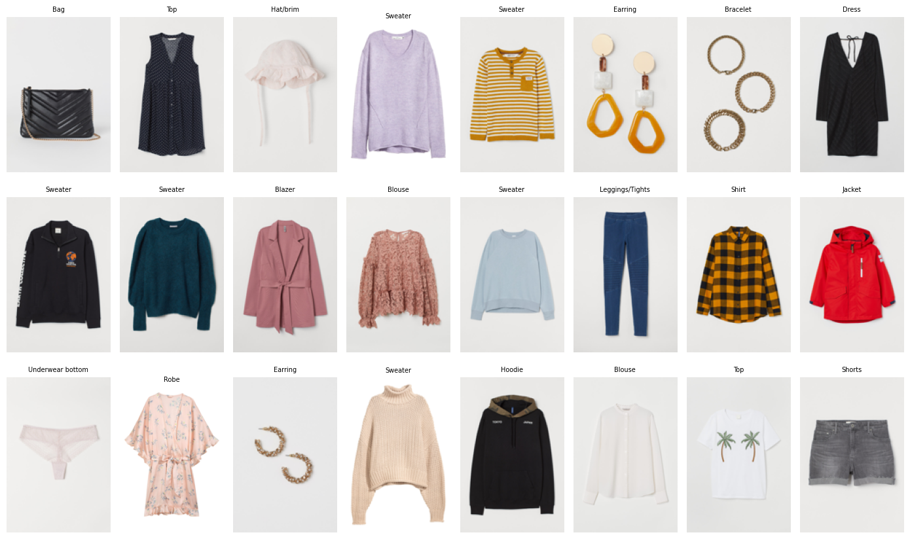

---

## Sampling and split

`src/data/sampling.py`

1. **Keep the last 140 days.** Fashion is seasonal. Using full histories put 73k articles in training, two thirds of them discontinued.
2. **Sample 6% of customers** (39,540 of 659,008) and keep all their purchases. Sampling customers rather than rows keeps each customer's purchase sequence intact.
3. **Store-wide sales file.** Bestseller lists, article statistics and the list of articles on sale are counted from *every* customer (`article_sales.parquet`), since a shop sees all of its sales, not just the sampled 6%.

| split | dates | transactions | customers | articles |
|---|---|---|---|---|
| train | 2020-05-06 → 2020-09-08 | 352,678 | 37,764 | 26,672 |
| validation | 2020-09-09 → 2020-09-15 | 15,184 | 4,383 | 5,537 |
| test | 2020-09-16 → 2020-09-22 | 14,561 | 4,155 | 5,244 |

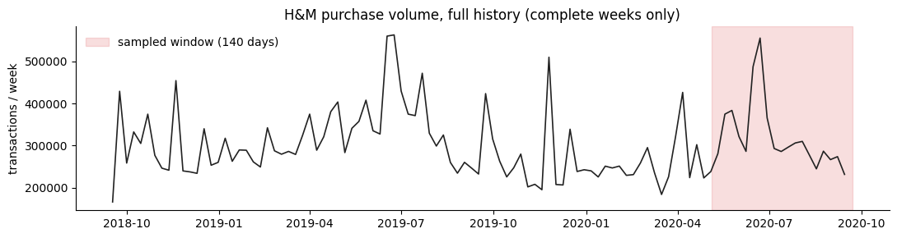

The rules every model follows:
- **Split by time.** No future data is ever used to predict the past.
- **Tune on validation, refit on train + validation, score test once.** This mirrors a weekly retrain. Skipping the refit loses the most recent week and roughly halves several models' scores.
- **Only recommend articles on sale.** Candidates are limited to articles sold store-wide by the end of the history (47,722 before the test week), so no model can recommend an article first sold during the week being predicted.

---

## Metrics

`src/evaluation/metrics.py` is shared by all five models. Each model returns `{customer: ranked article list}`.

| metric | question it answers |
|---|---|
| **MAP@k** (main) | Are the hits near the top? Divides by `min(#bought, k)`, as in Kaggle |
| NDCG@k | Same idea, with a log discount by position |
| Recall@k | What share of what they bought is in the list? |
| Precision@k | What share of the list did they buy? |
| Hit rate@k | Did they buy at least one item from the list? |

k = 12 (what the customer sees), 50 and 100 (how good the list is as a candidate pool).
Lists are deduplicated, and an empty list scores 0.

Beyond accuracy:
- **coverage** (share of on-sale articles that appear in any top-12 list)
- **novelty** (how un-obvious the recommended articles are, in bits)
- **diversity** (product types within one list)
- **segments** (cold / light / heavy customers)
- **oracle recall** (the best a perfect ranker could do with a candidate pool)

---

## 1. Popularity

Everyone gets the same list: the top sellers. Customers with no history fall back to the **last 7 days' bestsellers** in every model.

This sets the floor. Any model that can't beat it isn't worth its complexity.

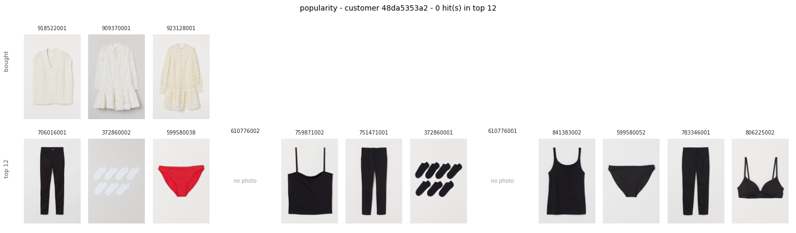

*Top row: what the customer bought in the test week. Bottom row: the model's 12, with hits outlined in green. The same customer is followed through all five models (0 → 1 → 2 → 3 → 3 hits). These examples were picked to show what each model does; most customers get no hits from any model (hit@12 is 13% for model 5).*

| MAP@12 | R@12 | R@100 |
|---|---|---|
| 0.0029 | 0.009 | 0.040 |

---

## 2. Collaborative filtering (ALS)

`src/models/als.py`

This model looks only at **who bought what**. ALS factorises the sparse customer × article matrix into a 512-number vector per customer and per article, and recommends the articles whose vectors point the same way as the customer's. It learns co-purchase patterns ("people who buy X also buy Y") without knowing anything about the items.

- **Time decay.** A purchase `d` days old counts `alpha / (1 + d)^p`.
- **BM25 weighting** pushes down the bestsellers everyone buys.
- **Already-bought articles are kept**, because people rebuy basics. Filtering them out halves the score.

**Tuning the decay.** `alpha` only *scales* every weight. The *shape* `p` decides how fast an old purchase fades. Both were swept together on the validation week:

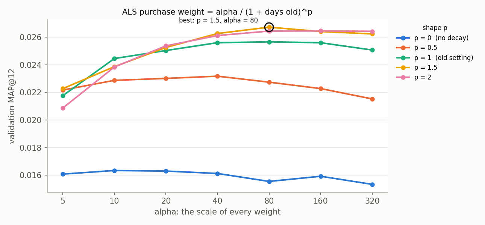

Best: p = 1.5, alpha = 80 (val MAP@12 0.0267). With no decay it is 0.0163, so recency is the biggest lever ALS has.

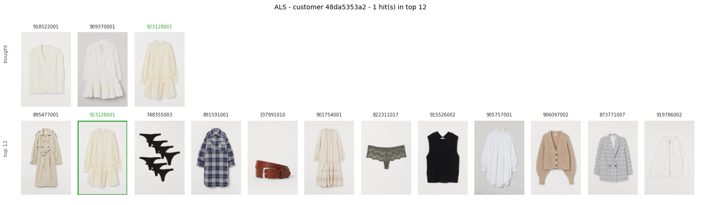

| MAP@12 | R@12 | R@100 |
|---|---|---|
| 0.0269 | 0.055 | 0.110 |

**Limitation:** an article nobody bought has no column in the matrix, so ALS can never recommend it.

---

## 3. Content-based

`src/models/content.py`

This model describes **what articles are**. Each article becomes four blocks, and similarity is an equal blend of the four cosines. A customer is the recency-weighted average (p = 1.5) of the articles they bought.

| block | contents | size |
|---|---|---|
| categories | one-hot product type, colour, department, section, … | 560 |
| words | TF-IDF of the description → SVD | 512 |
| photo | FashionSigLIP image embedding (frozen) | 768 |
| description | FashionSigLIP text embedding (frozen) | 768 |

FashionSigLIP was chosen over ResNet-18 and CLIP. Its photo neighbours share the same product type 78% of the time (CLIP 75%, ResNet 63%).

Ablations on the validation week:
- Removing **TF-IDF** costs 9.7%, the biggest loss of any block.
- Removing the **text embedding** costs 2.2%.
- The recency weighting matters: MAP@12 is 0.0114 with no decay and 0.0219 at p = 1.5.

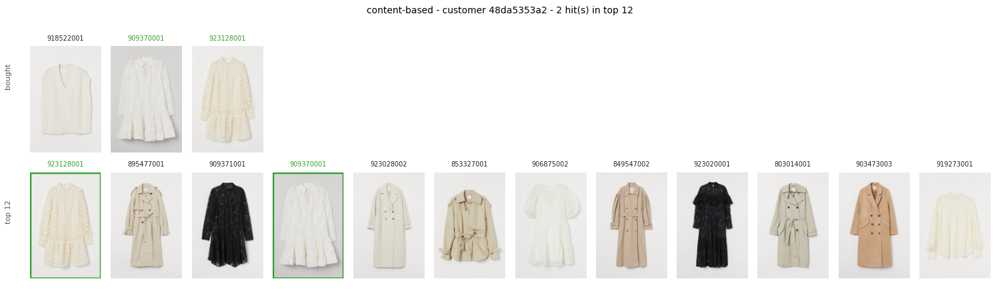

| MAP@12 | R@12 | R@100 |
|---|---|---|
| 0.0207 | 0.040 | 0.088 |

**Why keep it:** a never-bought article still has content, so it still gets a vector. On the 874 test purchases of articles no sampled customer had bought before:

| model | recall@12 | recall@100 |
|---|---|---|
| ALS | 0 (cannot) | 0 |
| content-based | **0.0091** | **0.0246** |
| two-tower | 0.0008 | 0.0100 |

---

## 4. Two-tower retrieval

`src/models/two_tower.py`

Two neural networks map customers and articles into the same 256-number space. Training pulls each customer close to the articles they bought. The score is the cosine between the two vectors.

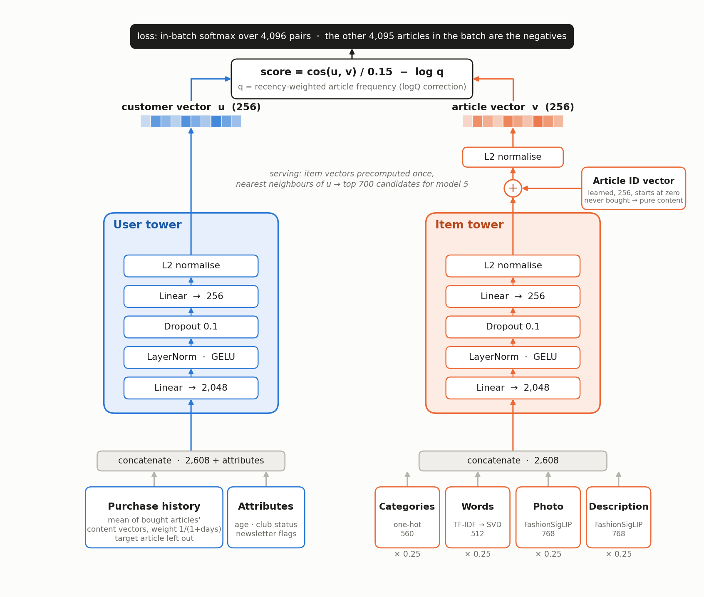

- **Item tower:** model 3's four content blocks go through an MLP. A **learned article-ID vector** is then *added*. It starts at zero and only changes for articles that get bought, so it carries the co-purchase signal, and a never-bought article stays purely content-based (cold start).
- **User tower:** the recency-weighted average (p = 1) of the content vectors of the articles the customer bought, plus age, club status and newsletter flags, through the same MLP shape.
- **Loss:** in-batch softmax. In a batch of 4,096 (customer, bought article) pairs, the other 4,095 articles act as negatives. Temperature is 0.15.
- **logQ correction:** popular articles show up as negatives more often, so `log(frequency)` is subtracted from each score to undo that bias.
- **Leave-one-out:** the target article is removed from the customer's history average. Otherwise the model can simply recognise the item itself.
- **Early stopping:** on the last week of the history with patience 10, then a refit on all data for the chosen number of epochs. AdamW (lr 3e-4) with a cosine learning-rate schedule.

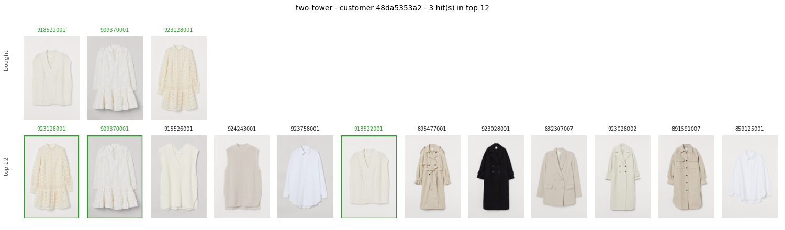

| MAP@12 | R@12 | R@50 | R@100 |
|---|---|---|---|
| 0.0210 | 0.048 | **0.102** | **0.147** |

The two-tower is below ALS on MAP@12 but has the **best recall of any single model from the top 50 onwards** (recall@100 is 34% above ALS). That makes it the main retriever for model 5.

---

## 5. Two-stage: retrieval + ranking

`src/ranking/`

Each model above is good at one thing. Bestsellers know what's trending, the two-tower
knows the person, and the content model knows what things look like. Model 5 combines
them the way large production recommenders do: a cheap stage finds candidates, then a
stronger model orders them.

```
48k on-sale articles
  │  Stage 1 · retrieval: union of three retrievers
  │    last week's bestsellers (700) · two-tower (700) · content (200)
  ▼
~1,200 candidates per customer   ← contains 51% of what they buy next week
  │  Stage 2 · ranking: LightGBM LambdaRank on 19 features per candidate
  ▼
top 12
```

- **Retrieval (aims for recall).** The retrievers only need to get the right article *somewhere* in the pool. Each one covers what the others miss: bestsellers reach customers with no history, the two-tower brings personal picks, and content brings never-bought articles.
- **Ranking (aims for precision).** For each candidate, the ranker sees where it came from, how it is selling, how this customer shops, and how well it fits them: price compared with their usual spend, whether they bought the same garment or product type before, and visual similarity to their purchases. It learns to order each customer's list so that real purchases come first.
- **No leakage.** The ranker is trained on four past weeks. Each week is rebuilt using only data from before that week, exactly as it will be used on the test week.

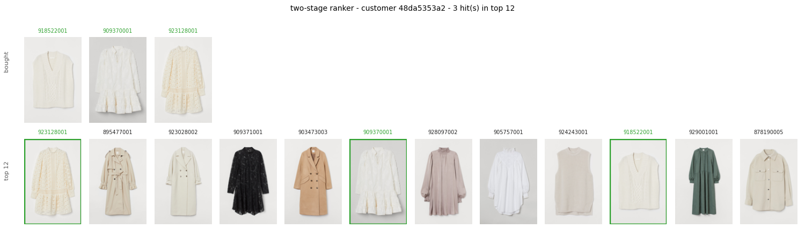

Two more customers. One is a heavy menswear buyer (34 past purchases); the other is a light sportswear buyer (4):

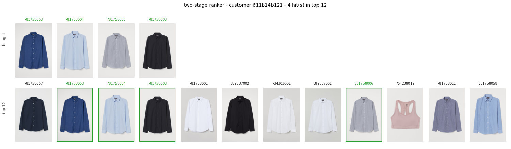

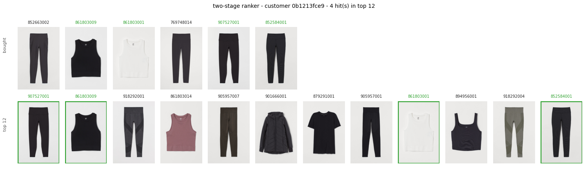

| | MAP@12 | R@12 | R@100 |
|---|---|---|---|
| stage 1 only (candidates in retriever order) | 0.0205 | 0.053 | 0.156 |
| **stage 2 (reranked)** | **0.0323** | **0.068** | **0.193** |

Reranking the same candidates adds 58% MAP@12. The main limit is retrieval: half of next
week's purchases never reach the ranker. Customers with no history score about 3× lower
(MAP@12 0.012 vs about 0.038), because only bestsellers can reach them.

---

## Results

All models are scored on the same test week, by the same code, for the same 4,155 customers.

| model | P@12 | R@12 | Hit@12 | NDCG@12 | **MAP@12** | R@50 | R@100 | Hit@100 | NDCG@100 |
|---|---|---|---|---|---|---|---|---|---|
| 1. Popularity | 0.0025 | 0.0094 | 0.028 | 0.0060 | 0.0029 | 0.022 | 0.040 | 0.107 | 0.0135 |
| 2. ALS | 0.0101 | 0.0554 | 0.098 | 0.0385 | 0.0269 | 0.083 | 0.110 | 0.208 | 0.0520 |
| 3. Content-based | 0.0070 | 0.0402 | 0.071 | 0.0287 | 0.0207 | 0.065 | 0.088 | 0.166 | 0.0407 |
| 4. Two-tower | 0.0094 | 0.0478 | 0.094 | 0.0320 | 0.0210 | 0.102 | 0.147 | 0.274 | 0.0567 |
| **5. Two-stage** | **0.0133** | **0.0683** | **0.129** | **0.0473** | **0.0323** | **0.136** | **0.193** | **0.358** | **0.0783** |

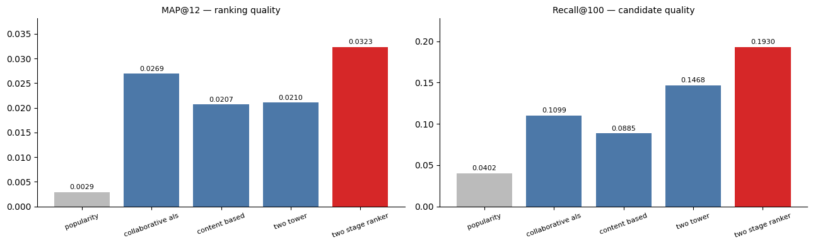

- Model 5 wins every column. It is 20% above ALS, the best single model, and 11× the popularity baseline on MAP@12.
- For scale: the winning Kaggle team scored 0.0372 MAP@12 on the full dataset with hundreds of features.
- **Noise:** the two-tower is not bit-reproducible on a GPU, so re-running model 5 moves MAP@12 by about ±0.0006 (σ). Only gains above about 0.0013 were accepted.

---

## Cross-validation

`src/evaluation/cross_validation.py`

One week scored once is one draw. The whole model 5 pipeline was re-run on **4 held-out weeks × 3 seeds**. Each fold refits everything using only the data before its own week.

```
fold 0   [════════ train ════════════════]  [test week]
fold 1   [════════ train ══════════]  [week]
fold 2   [════════ train ═════]  [week]
fold 3   [════════ train ]  [week]
```

| fold | week | customers | seed 42 | seed 7 | seed 13 | mean | pool ceiling |
|---|---|---|---|---|---|---|---|
| 0 | test week | 4,155 | 0.0320 | 0.0311 | 0.0319 | **0.0317** | 0.507 |
| 1 | −1 week | 4,383 | 0.0297 | 0.0307 | 0.0312 | **0.0305** | 0.492 |
| 2 | −2 weeks | 4,602 | 0.0258 | 0.0255 | 0.0246 | **0.0253** | 0.486 |
| 3 | −3 weeks | 4,936 | 0.0253 | 0.0245 | 0.0251 | **0.0250** | 0.484 |

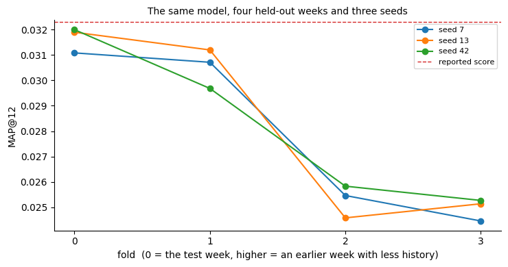

| what changes | std of MAP@12 |
|---|---|
| random seed, same week | 0.0006 |
| **held-out week** | **0.0035** |

- **Mean over all 12 runs: 0.0281 MAP@12** (range 0.0245 – 0.0320). This is the fairest single number for model 5.
- The week matters about **6× more than the seed**. The test week happens to be the easiest of the four.
- Every hyperparameter change in this project moved the score by less than the week-to-week spread. The gains that held up came from new information (retrievers, features, recency), not from tuning knobs.
- The headline table stays on the fixed test week, because models 1–4 share that week. That keeps the comparison between models fair.

---

## With more compute

- **Raise the ceiling.** Half of purchases never reach the ranker. Next steps: an item-to-item co-purchase retriever, "bought by similar customers", and a larger k.
- **Richer ranker features.** Use the retrievers' raw scores instead of only their ranks, and add age-group affinity per article. Winning solutions used hundreds of features.
- **Full data.** Use all 1.37M customers instead of a 6% sample. The two-tower in particular is data-hungry.
- **Fine-tune FashionSigLIP** on co-purchases, so that items bought together land close together in embedding space.
- **Sequence-aware user model.** A small transformer over the order of purchases, instead of a weighted average.

---

## Running it

```bash
pip install torch==2.11.0 torchvision==0.26.0 --index-url https://download.pytorch.org/whl/cu130
pip install -r requirements.txt
```

Put the Kaggle data in `data/raw/` (`transactions_train.csv`, `customers.csv`,
`articles.csv`, `images/`), then run from the repository root:

```bash
python -m src.data.sampling                 # window, sample, split, store-wide sales
python -m src.data.image_embeddings         # FashionSigLIP photos (a few minutes on GPU)
python -m src.data.text_embeddings          # FashionSigLIP descriptions

python -m src.models.popularity
python -m src.models.als                    # --tune-alpha: decay grid on validation
python -m src.models.content                # --tune-decay
python -m src.models.two_tower              # --tune-decay
python -m src.ranking.two_stage             # ~25 min, refits retrievers per label week

python -m src.evaluation.cross_validation   # 12 full runs, ~4.5 h
```

Each model appends a row to `results/metrics_comparison.csv`.
`notebooks/end_to_end.ipynb` runs the whole pipeline end to end, with every figure shown above.
Hardware: one RTX 4060 (8 GB).

### Layout

```
src/
  paths.py                 every location on disk
  data/                    loading + splits, sampling, image/text embeddings
  models/                  base interface, popularity, als, content, two_tower
  ranking/                 candidates (stage 1), features, two_stage (stage 2)
  evaluation/              metrics, reporting, cross_validation
api/                       precompute, store, FastAPI routes
web/                       React front end
results/                   metrics_comparison.csv, two_stage_report.json, tuning + CV CSVs
notebooks/end_to_end.ipynb EDA → all five models → comparison → CV
```
